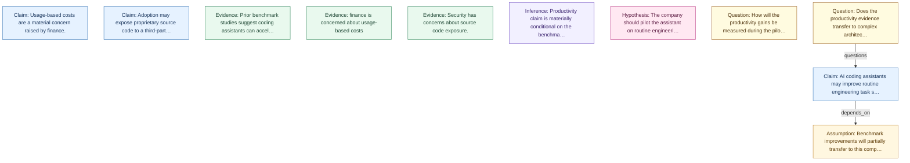

# Reasoning Receipt — rr_001

- **State:** `sr_001` v3
- **Generated:** 2026-06-26T00:30:00+00:00

## Summary

**Q.** Should the company adopt an AI coding assistant?

**A.** The company should pilot the assistant on routine engineering tasks while restricting it from architecture work.

## State Graph

## Claims Produced

- `claim_001` — AI coding assistants may improve routine engineering task speed. _(confidence 0.62, inferred, 1 evidence)_
- `claim_002` — Usage-based costs are a material concern raised by finance. _(confidence 0.85, observed, 1 evidence)_
- `claim_003` — Adoption may expose proprietary source code to a third-party service. _(confidence 0.83, observed, 1 evidence)_

## Evidence Used

- `ev_001` — Prior benchmark studies suggest coding assistants can accelerate routine tasks. _(source doc_001, medium)_
- `ev_002` — finance is concerned about usage-based costs _(source doc_001, high)_
- `ev_003` — Security has concerns about source code exposure. _(source doc_001, high)_

## Assumptions

- `assumption_001` — Benchmark improvements will partially transfer to this company's engineering workflow. _(impact high, confidence 0.58)_

## Contradictions

- _(none)_

## Open Questions

- `q_001` — How will the productivity gains be measured during the pilot? _(priority high)_
- `q_002` — Does the productivity evidence transfer to complex architecture work? _(priority high)_

## Transform History

- `transform_extract_001` — **extract_transform** (extract), v0→v1; wrote `claim_001`, `claim_002`, `claim_003`, `ev_001`, `ev_002`, `ev_003`, `assumption_001`
- `transform_planner_001` — **planner_transform** (plan), v1→v2; wrote `inf_001`, `hyp_001`, `q_001`, `rel_001`
- `transform_critic_001` — **critic_transform** (critique), v2→v3; wrote `claim_001`, `q_002`, `rel_002`

## Confidence Map

- **strongest:** `claim_002`, `claim_003`
- **weakest:** `claim_001`
- **assumption-sensitive:** `claim_001`

## State Diffs

### v0 → v1

- **added claim:** `claim_001`, `claim_002`, `claim_003`
- **added evidence:** `ev_001`, `ev_002`, `ev_003`
- **added assumption:** `assumption_001`

### v1 → v2

- **added inference:** `inf_001`
- **added hypothesis:** `hyp_001`
- **added question:** `q_001`
- **added relation:** `rel_001`

### v2 → v3

- **changed claim `claim_001`:** `confidence` 0.74 → 0.62
- **added question:** `q_002`
- **added relation:** `rel_002`

## Audit

- **committed:** `patch_001`, `patch_002`, `patch_003`
- **reviewed:** _(none)_
- **rejected:** _(none)_

